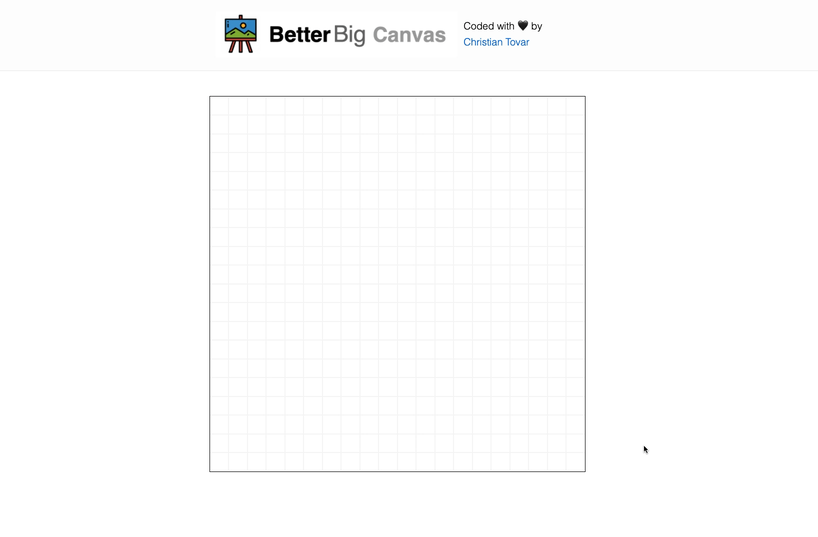
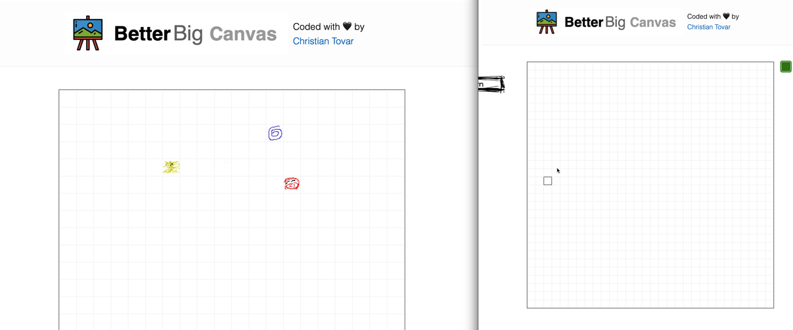

# Better Big Canvas

## Description

__Better Big Canvas__ is an improved version of Tech Lead's __Big Canvas__ written in Elixir from scratch. It uses Phoenix LiveView for server side rendering and supports real-time pubsub drawing support.

---
## Getting Started

To start __Better Big Canvas__:

  * Install dependencies with `mix deps.get`
  * Install Node.js dependencies with `npm install` inside the `assets` directory
  * Start Phoenix endpoint with `mix phx.server`
  * Create/Reset the mnesia database by visiting [`localhost:4000/reset`](http://localhost:4000/reset) 

Now you can visit [`localhost:4000`](http://localhost:4000) from your browser, enjoy drawing to your heart's content!

---
## Drawing Example

Click on any square from the main board, you'll be redirected to a canvas where you can draw anything you want. If you return to the main board, you can preview what you just drew, take a look:

## Real-Time Example

One of the main features of __Better Big Canvas__, is the ability to update the previews of the main board in real-time! Everytime you update a canvas, the changes will be immediately reflected on the correspoding preview canvas of the board. Here's an example of 2 browser windows opened at the same time, if a canvas is edited, the main board will reflect those changes:

## License

MIT. See the [`LICENSE.md`](LICENSE.md) in this repository for more details.